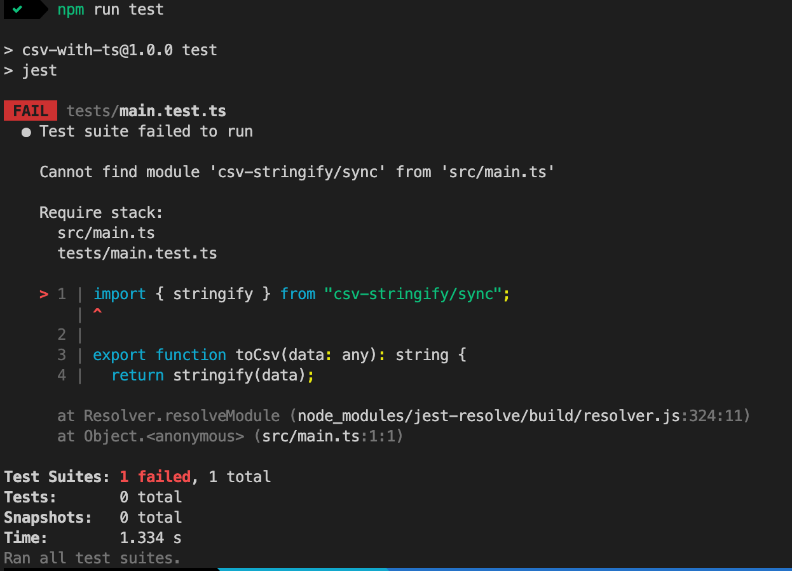

# csv-stringify module cannot be found in running by ts-jest

This repository was created for reporting issue.

## Details

When I use `csv-stringify/sync` in my code, it's fine by ts-node. However when I run code by ts-jest, I will get `Cannot find module "csv-stringify/sync"`.

### ScreenShot

It's OK by ts-node!

But it will fail by ts-jest ;(

## Environment

- Nodejs: v16.13.1
- TypeScript: 4.5.2
- Jest: 27.4.3
- ts-jest: 27.1.0

I ran this repository on macOS Big Sur 11.6 (20G165).
